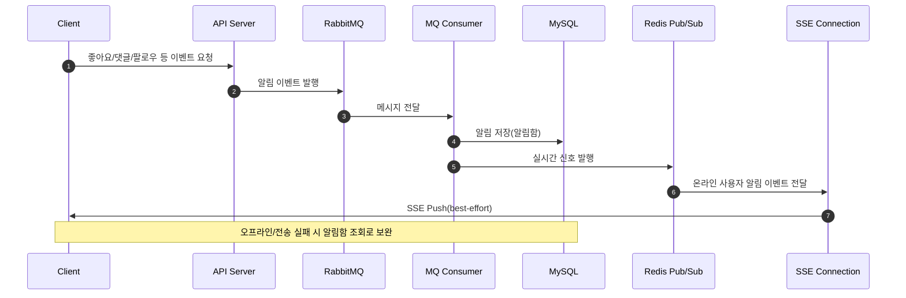
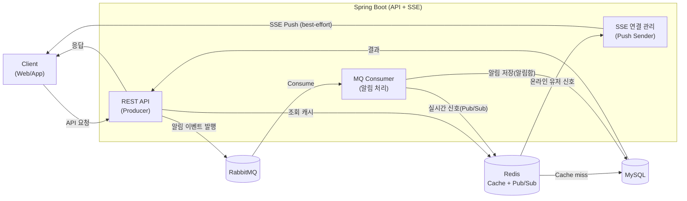

# 아키텍처 의사결정 기록(ADR)

## 1) 문서 목적과 범위

이 문서는 Fit Check 서비스의 **시스템 전체 기술 스택 선정 근거**와 **대안 비교**, **한계/리스크**를 근거 기반으로 정리한다.

- 대상 범위: 런타임/프레임워크, DB, 캐시, 메시지 큐, 실시간 알림, 향후 채팅 확장
- 제외 범위: 기능 상세 API 스펙(도메인 테크 스펙 문서에 위임)

---

## 2) 결정 요약(현재 기준)

- Runtime: **Java 21 LTS**
- Framework: **Spring Boot 3.5.x + Spring Framework 6.1+**
- DB: **MySQL 8.4 LTS**
- Cache/State: **Redis 8.4.x**
- Message Queue: **RabbitMQ 4.x**
- 실시간 알림: **SSE + MQ + Redis Pub/Sub**
- 채팅: **기술 도입 필요성은 확정, 전송 프로토콜/스토리지 분리는 추가 결정(Deferred)**

---

## 3) 배경 및 요구사항

### 기능 요구사항

- 사진 중심 SNS: 게시글/댓글/좋아요/팔로우/알림(준실시간)
- 실시간 알림 조건: 팔로우, 팔로우한 사용자의 게시글 업로드, 내 게시글의 댓글/좋아요
- 투표 기능: 생성 및 투표, 24시간 후 자동 종료
- 인증/인가: JWT + Spring Security, 카카오 소셜 로그인
- 비동기 처리 및 성능 최적화
- 서비스 확장: 체류 시간 증가를 위한 실시간 채팅 도입

### 비기능 요구사항(핵심 질문)

- 지연 허용치: 알림은 수 초 이내(준실시간), 채팅은 더 낮은 지연 목표
- 전달 보장: 알림함 저장은 **유실 불가**, 실시간 전송은 **best-effort 허용**
- 순서 보장: 알림은 엄격 순서보다 **최신성 우선**, 채팅은 **채널 내 순서 우선**
- 장애 대응: 재시도/격리/DLQ/멱등 보장 필요
- 확장성: 피크 트래픽 완충(Backpressure)과 소비자 확장

---

## 4) 런타임/프레임워크 결정

### Java 21 LTS 선정

- 알림(SSE) 및 향후 채팅으로 **동시 연결 수 증가**를 예상
- 가상 스레드로 **블로킹 I/O 코드 유지**하면서 동시성 효율 개선

#### Java 버전 비교

| Java 버전 | 가상 스레드 | 판단 |
| --- | --- | --- |
| 8/11 LTS | X | Spring Boot 3.x 미지원 → 제외 |
| 17 LTS | X | 안정적이지만 동시성 효율 측면에서 우선순위 낮음 |
| 21 LTS | O | 현재 요구사항에 최적 |
| 25 LTS | O | 최신이지만 운영 안정성/레퍼런스 측면에서 보수적으로 미선정 |

### Spring Boot 3.5.x + Spring Framework 6.1+ 선정

- 인증/인가/트랜잭션/예외처리 등 횡단 관심사를 **일관된 방식으로 관리**
- 최신 Spring 생태계와 호환, 장기 유지보수 유리

---

## 5) 데이터베이스 결정

### MySQL 8.4 LTS 선정

- 관계형 정합성(유니크/FK/트랜잭션)이 핵심
- PostgreSQL 강점(고급 쿼리/분석)이 핵심 요구는 아님
- 8.4 LTS로 장기 운영 안정성과 업그레이드 리스크 최소화

#### DB 후보 비교

| DB | 적합성 |
| --- | --- |
| MySQL 8.0 | 안정적이나 LTS 아님 |
| MySQL 8.4 LTS | 장기 운영 기준 최적 |
| PostgreSQL | 복잡 분석/쿼리에 강점 있으나 운영 복잡도↑ |

### 채팅 도입 시 DB 확장 전략(보류 결정)

- 채팅 메시지: 쓰기 중심, 빠른 누적, 시간순 조회 요구
- 메인 도메인과 **스토리지 분리**를 전제하고 도입 시점에 재검토

---

## 6) 캐시/상태 저장소 결정

### Redis 선정 이유

- TTL/자료구조/원자 연산/분산 락 등 **캐시 + 상태성 연산**에 적합
- 캐시, 토큰, 카운터, Pub/Sub 등 **운영 패턴 폭넓게 지원**

#### 캐시 후보 비교

| 후보 | 한계 |
| --- | --- |
| 앱 메모리 캐시 | 인스턴스 간 불일치, 재시작 시 소실 |
| 로컬 디스크 캐시 | I/O 지연, 분산 불가 |
| CDN 캐시 | 정적 리소스에 적합, 동적 API에는 부적합 |
| Memcached | 단순 캐시에는 유리하나 원자 연산/확장성 약함 |
| Redis | 기능 확장성, 운영 패턴 대응력 우수 |

#### Redis 활용 범위

- Cache-Aside 조회 캐시
- 카운터/집계(원자 연산)
- 세션성 상태(RTR/토큰)
- Pub/Sub(실시간 전파)

---

## 7) 메시지 큐 결정

### RabbitMQ 선정 이유

- 알림 이벤트는 **유실 없는 저장 보장**이 핵심
- ACK/DLQ/재시도로 **작업 완료 보장**에 최적
- 알림은 작업 큐(Work Queue) 성격이 강해 **작업 완료 보장**이 우선이며,
  이벤트 로그 자산화(장기 보관/리플레이)는 현재 필수 요구가 아님
- 실시간 전파는 Redis Pub/Sub + SSE로 분리해 **내구성**과 **즉시성**을 역할 분담

#### MQ 후보 비교

| 후보 | 평가 |
| --- | --- |
| Redis Streams | 캐시 워크로드와 혼재 시 장애 격리 약함 |
| RabbitMQ | 작업 큐 성격에 최적, 운영 복잡도 중간 |
| Kafka | 리플레이/다중 소비자 강점, 운영 복잡도 높음 |

### Kafka 도입을 미루는 이유

- 현재는 **이벤트 로그 자산화**보다 **작업 완료 보장**이 중요
- Kafka의 운영 비용/복잡도를 감수할 필요성이 낮음
- 다중 소비자/장기 보관/리플레이 중심의 구조적 요구가 아직 약함

### Kafka 도입 트리거

- 채팅 도입으로 이벤트 소비자 다수 분리 필요(저장/읽음/푸시/검색/분석 분리)
- 채팅 미읽음/정합성 복구를 위한 **이벤트 리플레이** 요구
- 피드/추천/분석 등 동일 이벤트를 여러 서비스가 **독립 소비**해야 하는 구조
- 장기 이벤트 보존/감사/재계산 요구

---

## 8) 실시간 알림/채팅 아키텍처

### 알림 파이프라인(결정)

- 알림 저장은 **DB가 Source of Truth**
- 실시간 전송은 **SSE + Redis Pub/Sub**로 best-effort 제공
- 이벤트 처리는 **MQ 기반 비동기**로 처리 보장
- 알림 이벤트는 **1차(대상 계산) → 2차(배치 저장/전송)** 큐로 분리해 팬아웃을 안전하게 처리

#### 알림 동작 흐름(mermaid)

### 알림 전송 방식 비교

| 방식 | 장점 | 한계 |
| --- | --- | --- |
| DB 폴링 | 단순 | 지연↑, DB 부하↑ |
| SSE | 서버→클라이언트 단방향 실시간 | 브라우저/연결 제약, 단방향 |
| WebSocket | 양방향 실시간 | 서버 연결 유지 비용, 인증/세션 복잡도↑ |

### 채팅(결정 보류, 추가 토론 필요)

- 요구사항 확인 필요: 지연 허용치/전달 보장/순서 보장 우선순위
- 후보: WebSocket 기반 실시간 전송 + MQ/Redis 통한 저장/전파 분리
- 스토리지는 메시지 특성에 따라 별도 DB/큐/스트림 검토

---

## 9) 시스템 아키텍처(요약)

---

## 10) 리스크 및 한계(운영 관점)

- 캐시 무효화/정합성: TTL/이벤트 기반 동기화 전략 필요
- Redis 메모리 압박: eviction 정책/메모리 모니터링 필수
- MQ 적체: 소비자 확장, DLQ/재시도 한계 설정 필요
- 멱등 처리: 알림 저장 중복 방지 키 필요
- SSE 연결: LB/프록시 타임아웃, 재연결/재전송 기준 명시 필요
- 채팅 도입 시: 순서/전달/지연 우선순위 결정이 핵심

---

## 11) 추가 토론(질문 기반)

- 이 기능이 지금 꼭 필요한 이유는 무엇인가? 사용자 행동/지표로 설명해볼래?
- 같은 문제를 DB 폴링/동기 처리로 풀면 어디서 한계가 터지나?
- Redis/MQ 도입으로 사라지는 병목과 새로 생기는 운영 복잡도는?
- 알림/채팅에서 지연·전달·순서 보장 중 무엇을 우선할까?
- 장애 시 어떤 사용자 경험이 깨지며, 복구 전략은?

---

## Reference

- Java + Spring 선택 이유: https://prime-career.com/article/11242
- JEP 444 - Virtual Threads: https://openjdk.org/jeps/444
- Spring Boot 3.3.x 지원 종료: https://spring.io/blog/2025/06/19/spring-boot-3-3-13-available-now
- Spring Boot 마지막 마이너 버전의 장기 지원 정책: https://spring.io/support-policy
- 최신(25년 12월) Spring Boot 4.0.1 출시: https://spring.io/blog/2025/12/18/spring-boot-4-0-1-available-now
- Java 21 가상 스레드와 호환성이 좋은 Spring Framework 6.1: https://github.com/spring-projects/spring-framework/wiki/Spring-Framework-6.1-Release-Notes
- Spring Framework 6.1을 지원하는 Spring Boot 3.2.x: https://github.com/spring-projects/spring-boot/wiki/Spring-Boot-3.2-Release-Notes
- MySQL과 PostgreSQL의 차이점: https://aws.amazon.com/ko/compare/the-difference-between-mysql-vs-postgresql
- Redis 최신 버전: https://github.com/redis/redis/releases
- RabbitMQ 최신 버전: https://www.rabbitmq.com/release-information
- RabbitMQ 4.1 성능 개선: https://www.rabbitmq.com/blog/2025/04/08/4.1-performance-improvements
