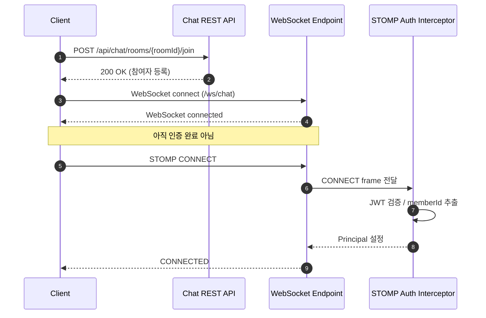
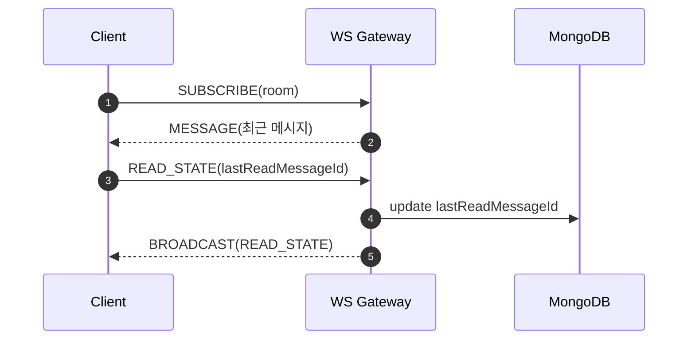

# 그룹 채팅 도메인 테크 스펙 (Chat)

## 배경 (Background)

- 프로젝트 목표: 그룹 채팅 실시간 대화와 메시지 이력을 제공한다.
- 문제 정의:
  - 실시간 전송과 저장을 분리해야 장애 시 데이터 유실을 줄일 수 있다.
  - 멀티 인스턴스 환경에서 fan-out이 필요하다.
  - 안읽음 수 계산이 필요하다.

## 요구사항 (Requirements)

- 채팅방
  - 채팅방 `제목` / `참여 인원 수` / `썸네일 이미지(선택)`
  - 로그인한 **활성 사용자**만 생성 가능
  - 채팅방 **정보 수정/삭제는 생성자만 가능**
  - 생성자는 **퇴장하기** 불가능
  - 채팅방 삭제 시 **모든 채팅 내용 삭제**
- 참여/입장/퇴장
  - 채팅방 **참여하기**를 통해서만 입장 가능
  - **퇴장 후에는 다시 참여해야** 입장 가능
  - 비밀번호/익명 참여 없음
- 메시지(텍스트/이미지)
  - 메시지에 사용자 **닉네임 / 프로필 이미지/전송시간** 포함
  - 이미지 전송도 메시지 1건으로 취급
  - 이미지 전송 시:
    - `message` 필드는 `"사진"`
    - `imageObjectKey` 필드에 S3 오브젝트 키 저장
  - 텍스트 전송 시:
    - `message` 필드에 본문 저장
    - `imageObjectKey`는 비움(null)
- 채팅방 목록
  - 방별 `참여 인원 수`, `안읽음 메시지 수`, `실시간 알림 on/off(사용자별)`
  - 익명 없음, 프로필 정보는 서비스 설정값을 사용

## 목표가 아닌 것 (Non-goals)

- 메시지 번역/필터링

## 설계 및 기술 자료 (Architecture and Technical Documentation)

### 채널/전송

- WebSocket 기반 실시간 전송
- Redis로 세션/채널 매핑
- 멀티 인스턴스 fan-out: Redis PubSub 또는 Stream
- 채팅 메시지는 `/ws/chat`으로 양방향 유지.
- 채팅 알림은 알림 SSE(`/api/notifications/stream`)로 전달하고 `event: chat`으로 구분한다.

### 채팅 소켓 연결 시작 흐름



### CONNECT
> WebSocket 연결 위에서 STOMP 세션 사용자(Principal) 설정

```text
CONNECT
accept-version:1.2
host:{{host}}
Authorization:Bearer {{AT}}

\0
```

### SUBSCRIBE
> 메시지 구독

```text
SUBSCRIBE
id:sub-messages
destination:/topic/chat/rooms/{roomId}/messages

\0
```

> 읽음 상태 구독

```text
SUBSCRIBE
id:sub-read-state
destination:/topic/chat/rooms/{roomId}/read-state

\0
```

- 최초 구독 시 서버가 **해당 구독 세션에만** 참여자 전체의 `lastReadMessageId` 스냅샷을 1회 전송한다.
- 이후에는 같은 채널로 `READ_STATE` delta 이벤트를 계속 전송한다.

### SEND
> 메시지 전송

```text
SEND
destination:/app/chat.message
content-type:application/json

{"roomId":"69b5bbc08e52663be78a0d10","message":"안녕","imageObjectKey":null}\0
```

> 이미지 전송
```text
SEND
destination:/app/chat.message
content-type:application/json

{"roomId":"69b5bbc08e52663be78a0d10","message":null,"imageObjectKey":"chat/rooms/69b5bbc08e52663be78a0d10/sample.webp"}\0
```


### 개발 순서 (Implementation Plan)

1) 테이블 정의 및 마이그레이션
   - `chat_rooms`, `chat_members`, `chat_messages` DDL 확정
   - 인덱스/유니크 정책 확정
2) WebSocket 핸드셰이크/인증
   - Access Token 검증 및 연결 사용자 식별
   - 룸 참가 권한 검증
3) 메시지 전송/저장 분리
   - 전송은 즉시 처리, 저장은 비동기 워커로 분리
   - 메시지 순서는 room 단위로 보장
4) 안읽음 수 계산
   - 멤버별 `lastReadAt` 또는 `lastReadMessageId` 기준으로 계산
   - 목록 조회 시 room 기준 미읽음 수를 산출
5) 알림 연동
   - 룸 미참여 사용자 대상 `event: chat` 알림 전송
   - 알림 끔 정책은 비즈니스 알림에만 적용
6) 실패/재처리 정책
   - 저장 실패 재시도/DLQ 처리
   - 전송 실패는 best-effort 처리
7) 테스트/모니터링
   - 단위 테스트 + 간단 통합 테스트
   - 전송 지연/실패 지표 수집

### 저장소 선택

#### MySQL을 사용하지 않은 이유
- 높은 쓰기 TPS와 burst(동시 메시지 폭증) 구간에서 인덱스/락 경합이 빠르게 커진다.
- room 단위 샤딩이 필요하지만 MySQL 샤딩/파티셔닝은 운영 복잡도와 비용이 급격히 증가한다.
- 메시지 보관/아카이브 정책(TTL, 오래된 메시지 정리)을 유연하게 적용하기 어렵다.
- 조회 패턴이 "방 단위 최신 N개"에 집중되므로 문서/파티션 기반 스토리지에 더 적합하다.
- 그룹 채팅까지 확장할 경우 쓰기/조회 스케일 요구가 커져 RDB 확장 여지가 제한적이다.

#### NoSQL 선택의 이점
- 샤딩 키(room_id) 기준 수평 확장이 단순하다.
- 고쓰기 워크로드에 유리한 구조로 평균/꼬리 지연을 낮출 수 있다.
- 메시지 메타(첨부/반응/수정 등) 확장이 스키마 변경 없이 가능하다.

#### 트레이드오프 및 보완
- 트랜잭션/정합성 범위가 줄어든다.
  - 보완: room 단위 순서 보장, idempotency 키, 재시도/DLQ로 보강한다.
- 운영 복잡도(샤딩/모니터링/복구)가 증가한다.
  - 보완: 초기부터 운영 지표/백업/복구 절차를 문서화한다.

### 프로필 데이터 연동(닉네임/프로필 이미지)

#### 문제
- 사용자 프로필(닉네임/프로필 이미지)은 MySQL에 있음.
- 채팅 서버가 MongoDB만 사용하면 메시지 조회 시 매번 MySQL 조회가 필요할 수 있음.

#### 선택지
1) **조회 시 실시간 MySQL 호출**
   - 장점: 최신 프로필 보장
   - 단점: 채팅 조회가 느려지고, 서비스 간 결합도가 커짐

2) **메시지 저장 시 스냅샷 저장**
   - 메시지에 `senderNicknameSnapshot`, `senderProfileImageSnapshot` 저장
   - 장점: 조회 시 DB 한 곳에서 해결, 읽기 성능 안정
   - 단점: 프로필 변경 시 과거 메시지는 갱신되지 않음(의도된 정책)

3) **프로필 캐시/동기화 컬렉션 유지**
   - MySQL 변경 이벤트를 받아 MongoDB `chat_users`를 동기화
   - 장점: 최신성 + 조회 성능 균형
   - 단점: 이벤트 파이프라인 운영 복잡도 증가

#### 권장 방향
- **메시지 스냅샷 저장 + 프로필 조회 캐시** 조합을 우선 적용한다.
- 최신성보다 “읽기 성능/단순 운영”을 우선한다는 정책을 명시한다.

## API 명세 (API Specifications)

- 채팅방 생성/조회: `POST /api/chat/rooms`, `GET /api/chat/rooms`
- 채팅방 수정/삭제: `PATCH /api/chat/rooms/{id}`, `DELETE /api/chat/rooms/{id}`
- 채팅방 참여/퇴장: `POST /api/chat/rooms/{id}/join`, `DELETE /api/chat/rooms/{id}/leave`
- 채팅방 입장: `GET /api/chat/rooms/{id}` (참여자만)
- 메시지 생성/목록: `POST /api/chat/rooms/{id}/messages`, `GET /api/chat/rooms/{id}/messages`
- 실시간 전송: `WS /ws/chat`
- 알림 스트림: `GET /api/notifications/stream` (알림/채팅 알림 공용)

## 장애/예외 처리

- 기본은 동기 저장(write-through)이며 저장 실패 시 오류를 반환한다.
- 비동기 전환 시 메시지 저장 실패는 재시도 큐 적재로 보완한다.
- 중복 전송은 클라이언트 idempotency 키로 방지한다.

## 읽음 처리 트리거

- 트리거는 **ACK 1가지로 통합**한다.
- 방 입장 시 최신 메시지를 받은 뒤 클라이언트가 **READ_STATE(ACK)** 이벤트를 전송한다.
- 방에 머무는 동안 새 메시지를 수신하면 **ACK 이벤트로 lastReadMessageId를 갱신**한다.
- 결과적으로 “입장 시 읽음 처리”와 “수신 시 읽음 처리”를 동일한 ACK 흐름으로 통합한다.
- ACK payload에는 `roomId`, `lastReadMessageId`만 포함한다.
  - `memberId`는 소켓 연결의 Principal(JWT)에서 서버가 추출한다.
 - 기본 전송 타이밍은 **입장 직후 1회 + 수신 시 ACK**이다.
 - 이벤트 폭주를 줄이기 위해 읽음 이벤트 배치(Throttle)를 적용할 수 있다(개선 후보).

### 읽음 ACK 흐름


## 안읽음 수 계산 기준

- 기준: **참여자별 lastReadMessageId 전파 + 클라이언트 계산**
  - 서버는 방 참여자 수와 각 참여자의 lastReadMessageId를 전달한다.
  - 클라이언트는 다음 공식을 사용해 메시지별 unreadCount를 계산한다.
    - `unreadCount(messageId) = totalParticipants - count(lastReadMessageId >= messageId)`
- 포함 대상: 텍스트/이미지 모두 1건으로 집계(사진도 메시지로 취급)
- 업데이트 시점:
  - 읽음 상태 채널 최초 구독 시 참여자 읽음 스냅샷을 1회 전달한다.
  - READ_STATE(ACK) 이벤트 발생 시 해당 참여자의 lastReadMessageId를 브로드캐스트한다.
- 예외 처리:
  - lastReadMessageId가 null이면 0으로 간주(아무 것도 읽지 않음)


## 이벤트 타입 도입(토픽 분리 대비)

### 목적
- 초기에는 단일 토픽으로 운영하되, 추후 메시지/상태 토픽 분리 비용을 최소화한다.

### 이벤트 타입
- `MESSAGE`: 채팅 메시지 전송(텍스트/이미지)
- `READ_STATE`: 읽음 상태 갱신(lastReadMessageId)
- `MEMBER_JOIN`: 참여자 입장
- `MEMBER_LEAVE`: 참여자 퇴장

### 참여자 이벤트 payload

- `MEMBER_JOIN`
  - 포함: `roomId`, `memberId`, `participantCount`, `lastReadMessageId`, `timestamp`
  - 목적: 참여자 추가 + 인원 수 갱신 + 읽음 상태 초기 동기화
- `MEMBER_LEAVE`
  - 포함: `roomId`, `memberId`, `participantCount`, `timestamp`
  - 목적: 참여자 제거 + 인원 수 갱신

## 참여자 스냅샷 전달

- 입장 시점에 **전체 참여자 스냅샷 1회 전달**한다.
- 스냅샷 포함 필드:
  - `memberId`, `nickname`, `profileImageObjectKey`, `lastReadMessageId`
- 이후 변경은 `MEMBER_JOIN`, `MEMBER_LEAVE`, `READ_STATE` 이벤트로만 갱신한다.
- 별도 참여자 목록 조회 API는 두지 않는다.

### 메시지 이벤트 payload

- `MESSAGE`
  - 포함: `roomId`, `messageId`, `senderId`, `senderNickname`, `senderProfileImageObjectKey`, `message`,
    `imageObjectKey`, `messageType`, `sentAt`, `eventType`
  - 텍스트: `messageType=TEXT`, `imageObjectKey=null`
  - 이미지: `messageType=IMAGE`, `message="사진"`, `imageObjectKey`에 S3 오브젝트 키

```json
{
  "eventType": "MESSAGE",
  "roomId": "room-id",
  "messageId": 12345,
  "senderId": 7,
  "senderNickname": "닉네임",
  "senderProfileImageObjectKey": "profile/7/uuid.png",
  "message": "안녕하세요",
  "imageObjectKey": null,
  "messageType": "TEXT",
  "sentAt": "2026-01-01T12:00:00Z"
}
```

### 단일 토픽 운영 규칙
- 메시지 페이로드에 `eventType`을 포함한다.
- 클라이언트는 `eventType` 기준으로 라우팅/핸들링한다.

### 토픽 분리 전환 전략
- 분리 대상: 메시지 스트림 vs 상태 스트림(read/참여/퇴장)
- 듀얼 발행 기간을 두고 기존 단일 토픽과 신규 토픽을 동시에 발행한다.
- 클라이언트 전환 완료 후 단일 토픽을 폐기한다.

## 메시지 순서 보장
- 순서는 **방(room) 단위**로만 보장한다.
- 정렬 기준은 저장 시점의 `messageId(증가)` 또는 `createdAt + id` 조합을 사용한다.
