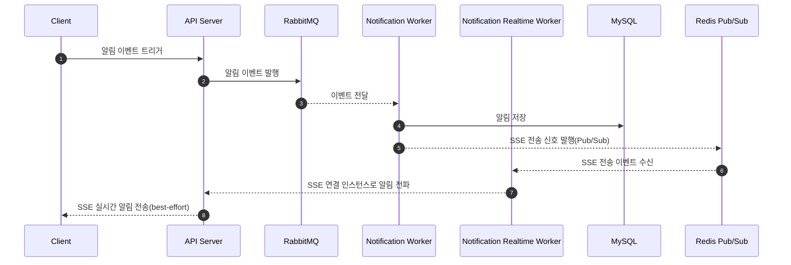
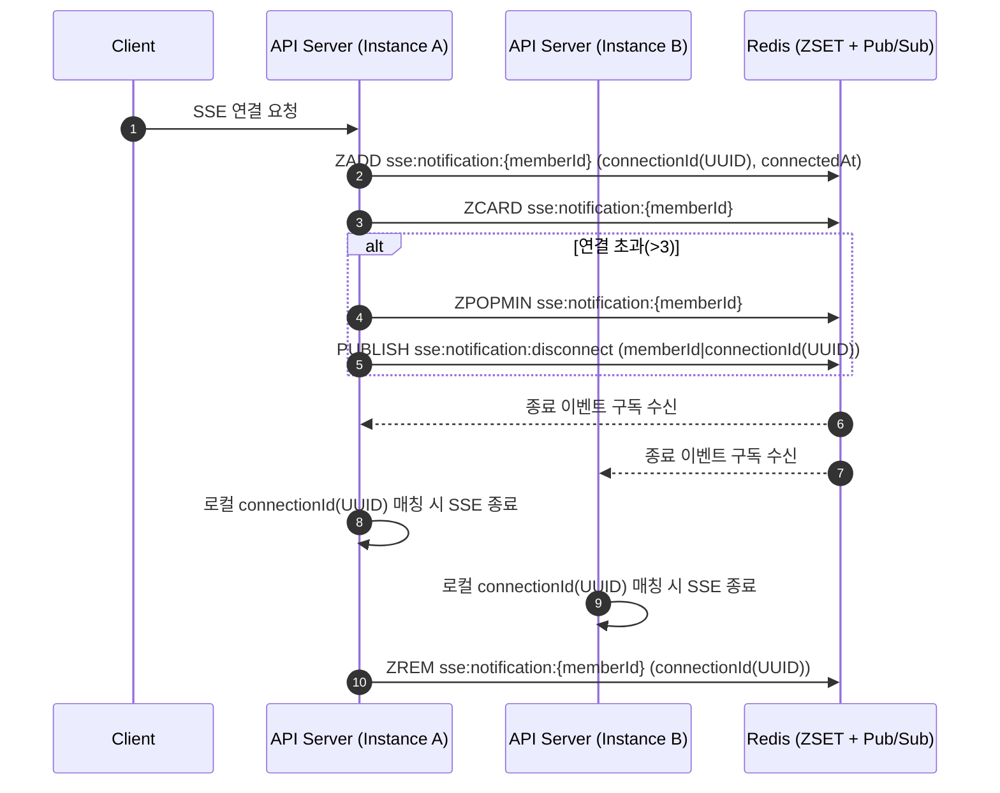
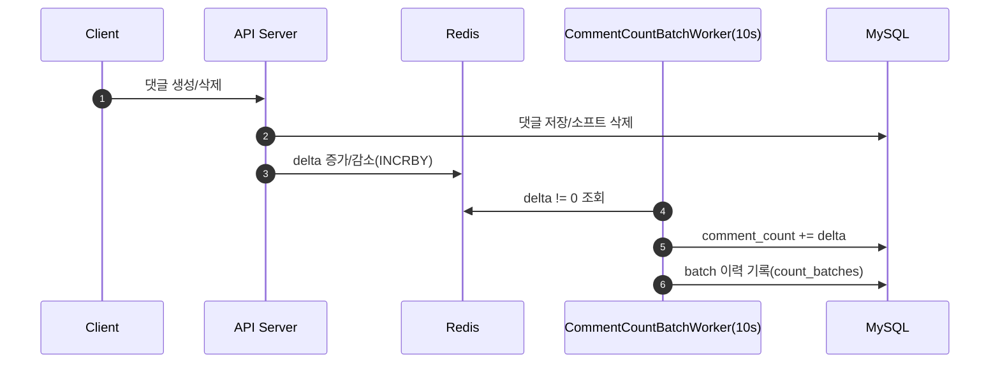

# 비동기 이벤트 아키텍처 (Asynchronous Event Architecture)

## 1. 목적 및 범위
> 멀티 인스턴스 환경에서 집계/알림/채팅을 비동기로 수행해 응답 지연과 장애 전파를 줄인다.

### 문제 정의
- 동기 처리만으로는 이벤트 처리 지연과 리소스 경쟁이 발생한다.
- 실시간 전달(SSE/WS)과 저장은 분리되어야 유실을 방지할 수 있다.

### Non-goals
- 글로벌 멀티리전 메시징: 다중 리전의 복잡도/비용이 현재 목표에 비해 과도하다.
- 스트림 분석/리플레이 기반 BI: 데이터 분석 파이프라인 요구가 확정되지 않았고, 이벤트 보관/리플레이 비용이 크다.
- 알림 등급(중요/일반) 분리 정책: 알림 비활성화는 존재하지만, 알림 별 등급은 요구사항에서 고려되지 않음.

## 2. 비동기 이벤트 흐름 개요

### 집계(댓글)

| Event | Trigger | Consumer | Idempotency | Retry |
| --- | --- | --- | --- | --- |
| CommentCountDeltaPublished | 댓글 생성 | CommentCountBatchWorker | Redis INCRBY 원자 연산 | 없음(복구 정책으로 보완) |

- 처리: 핫트래픽인 댓글 생성/삭제에 대한 집계를 Redis 원자적 연산으로 delta를 누적한다.
- 키: `count:comment:delta:{postId}` (postId 해시태그로 동일 키 슬롯 유지)
- 동기화: `3초` 주기로 `delta != 0`인 게시글을 찾아 DB에 반영한다.
- 복구: Redis 장애 시 last batch 이후 생성/삭제된 댓글만 재계산해 정합성을 맞춘다.

### 실시간 알림
- 전송: best-effort 방식의 SSE 전송을 지원한다.
- 보관: 실시간 알림 여부와 관계없이 알림은 DB 저장한다.

### 채팅
- 지원 범위: 그룹 채팅(N:M)
- 전송: best-effort 방식의 SSE 전송을 지원한다.
- 순서: 채팅 방 단위로 전송 순서를 보장한다.
- 보관: 전송과 저장을 분리해 비동기 처리를 한다.

## Redis


### 멱등성 기준
- eventId(UUID)를 멱등 키로 사용한다.
- 저장 계층에는 고유 제약 또는 UPSERT로 중복 처리를 방지한다.

### 메시징 인프라
- RabbitMQ: 저장/집계/비동기 처리용
- Redis Pub/Sub: 실시간 전파용

### 이벤트 스키마(메시지 포맷)
- 공통 필드:
  - eventId (UUID)
  - eventType
  - occurredAt (ISO8601)
  - actorId
  - targetId
  - refId (post/comment/vote 등)
  - payload (타입별 상세)

### 큐/토픽 구성
- exchange: `domain_events`
- queue:
  - `notification_queue`
  - `aggregate_queue`
  - `chat_persist_queue`
  - `chat_fanout_queue`
- DLQ:
  - `notification_dlq`
  - `aggregate_dlq`
  - `chat_persist_dlq`
  - `chat_fanout_dlq`


## 4. 실시간 알림(SSE)
```bash
GET /api/notifications/stream
```
- 단일 SSE 스트림에서 `notification`(비즈니스 알림)과 `chat`(채팅 알림)을 이벤트 이름으로 구분한다.
- `알림 끔 설정`은 `notification` 전송만 차단하며, 채팅 알림(`chat`)은 항상 전송한다.


### 실시간 알림 이벤트 흐름


### 보장 수준
- 실시간 전송: best-effort
- 알림 저장: at-least-once


<br>

### SSE 연결 제한/종료 전파 흐름



#### 설명
- SSE 연결 시 Redis ZSET에 connectionId를 등록한다. Redis에 연결된 사용자의 SSE 연결 개수를 확인(ZCARD)한다.
- 3개를 초과하면 가장 오래된 connectionId를 제거하기 위해  종료 이벤트를 Pub/Sub으로 전파한다.
- 모든 인스턴스는 종료 이벤트를 구독하며, 자신이 보유한 connectionId면 SSE를 종료한다.
- 종료된 connectionId는 Redis에서도 제거해 상태를 정리한다.
  - 초과 연결 제거 시에는 ZPOPMIN으로 이미 제거된 connectionId에 대해 ZREM이 중복 호출될 수 있다. 이 경우 ZREM은 no-op이므로 안전하다.
  - ZREM은 정상 종료/타임아웃/에러 등 다양한 경로에서 Redis 상태를 일관되게 정리하기 위한 최종 정리 단계로 호출한다.
- Redis 키는 `sse:notification:{memberId}`으로 하여 동일 사용자 SSE 연결을 동일 슬롯으로 묶는다.
  - `sse`는 실시간 연결 카테고리, `notification`은 도메인 구분을 위한 prefix다. 채팅 실시간 알림은 `chat`으로 구분된다.
  - `{memberId}` 해시태그는 Redis Cluster 환경에서 동일 사용자 키를 같은 슬롯으로 묶기 위함이다.
- 값(ZSET): `connectionId(UUID)` -> `connectedAt(epoch ms)`
  - 연결 시간 순 정렬과 `ZPOPMIN` 기반의 오래된 연결 제거를 위해 ZSET을 사용한다.
  - `connectionId`는 동일 ms 충돌을 피하고, 특정 SSE emitter를 정확히 종료하기 위한 식별자다.

#### 인증
- `Authorization: Bearer {AT}` 헤더 기반

#### 응답 헤더
SSE/HTTP 표준에 따른 권장 설정

- `Content-Type: text/event-stream`
- `Cache-Control: no-cache`
- `Connection: keep-alive`

#### 이벤트 포맷
```
id: {eventId}
event: notification
data: {"id":1,"type":"POST_LIKE","message":"...","refId":100}
```
```
id: {eventId}
event: chat
data: {"roomId":10,"senderId":2,"message":"..."}
```

#### 재연결/재전송 정책
- 클라이언트는 자동 재연결(EventSource 기본 동작).
- 서버는 재접속 시 최근 10건의 미수신 알림을 재전송한다: 재접속 직후 UX를 보장하면서도 과도한 재전송 부하를 방지하기 위함.
- 미수신 기준은 `read_at is null`이며, 최근 10건을 `created_at desc`로 조회한다.
- 서버 SSE 타임아웃은 30분으로 운용한다(연결 유지를 보장하면서도 유휴 연결을 정리하기 위함).
- 재연결 시점(클라이언트가 새 SSE 연결을 수립하는 순간)을 기준으로 Redis 연결 시간/상태를 갱신한다.
- 서버는 20초 간격으로 `ping` 이벤트를 전송해 연결 상태를 감지한다.

#### 동시 접속 제한
- 사용자당 SSE 연결은 최대 3개까지 허용한다(모바일+PC+태블릿 기준).
- 3개를 초과하는 신규 연결이 들어오면 가장 오래된 연결을 종료한다.
- 연결 상태는 Redis에 저장해 인스턴스 간 동시 접속 제한을 강제한다.
- SSE 생존시간 * 2 주기로 유효하지 않은 연결을 정리한다(유령 연결 누적 방지 목적).
- 유효하지 않은 연결은 `연결시간 + SSE 생존시간 < 현재시간` 기준으로 판별한다.
- 연결 단위로 관리하며, 활성 기기가 재연결될 때 비활성 기기 연결이 밀리는 것을 허용한다(활성 기기 우선 정책).
- 가장 오래된 연결 종료는 Redis Pub/Sub으로 종료 이벤트를 전파한다.
- 종료 이벤트 채널명은 `sse:notification:disconnect`를 사용한다.
- 종료 이벤트 메시지는 최소 `{memberId, connectionId}` 형식을 사용한다.

#### 운영/스케일링 고려
- SSE 연결은 장시간 유지되므로, 서버 스레드 점유가 최소화되도록 비동기(서블릿 async) 처리로 운용한다.
- 수평 확장 시 Sticky Session 또는 Redis Pub/Sub으로 인스턴스 간 팬아웃을 고려한다.
  - SSE 연결은 인스턴스 로컬에 매달리므로 라우팅 정책이 중요하다.
- 동시 접속 제한을 전역으로 강제하기 위해 Redis에 연결 상태를 저장한다(Sticky Session의 부하 분산 한계 보완).
- Redis 장애 시에는 실시간 알림(SSE 전송)을 제공하지 않고, 알림함 조회로 대체한다(서비스 성격상 실시간 전송은 필수가 아님).
- Redis 운영은 단일 논리 클러스터(단일 Redis/Redis Cluster) 전제를 따른다.

#### 알림 저장/보관 정책
- 알림은 DB에 저장한다.
- 생성일 기준 30일이 지나면 읽음 여부와 무관하게 삭제한다.

#### SSE vs WebSocket 선택 근거
- 알림은 단방향이므로 SSE가 적합.
- SSE는 HTTP 업그레이드 없이 `text/event-stream` 기반으로 유지되며, WebSocket 업그레이드/전용 타임아웃/세션 고정 설정 같은 프록시/LB 설정 부담이 상대적으로 낮다.
- 단방향 스트림이므로 서버는 클라이언트 전송 채널(예: ping/pong, 백프레셔, 송신 큐)과 같은 양방향 상태를 별도로 관리하지 않아도 되고, 메시지 전송/재연결은 클라이언트(EventSource)가 주도한다.
- 다만 SSE도 장시간 연결을 유지하므로 만료/정리(유령 연결 정리, 다중 인스턴스 전파)는 필요하다.
- 채팅은 양방향이므로 WebSocket을 사용한다.
- 채널 역할을 분리해 알림(SSE)과 채팅(WebSocket)의 운영/스케일링 요구사항을 분리한다.

### 재시도/DLQ 정책
- 재시도 대상: 알림 저장 실패에 한정한다.
- 실시간 전송(SSE) 실패는 재시도하지 않는다.

## 5. 채팅 비동기 처리(작성중)

### 채팅 이벤트 흐름(요약)
- 채팅 전송: `ChatMessageSent` -> ChatPersistWorker, RealtimeFanoutWorker
- 순서 보장: 채팅방 단위 순서를 유지한다.

### 보장 수준
- 실시간 전송: best-effort
- 메시지 저장: at-least-once

### 재시도/DLQ 정책
- 저장 실패는 재시도 후 DLQ로 격리한다.
- 실시간 전송 실패는 best-effort로 처리한다.

## 6. 댓글 집계 비동기 처리

### 집계(댓글) 시퀀스


### 보장 수준
- Redis delta 적립: at-least-once
- DB 반영: at-least-once

### 결정 근거
- 동기 집계를 단순 적용했을 때, 100명 사용자가 1분 동안 댓글을 작성/삭제하는 상황을 가정하고 슬립 3초로 부하를 준 실험에서 데드락이 발생했다.
- 슬립 3초는 보편적인 댓글 속도에 대한 가정치이며, 실제 트래픽 변동 폭을 고려해 비동기 delta 적립 + 배치 반영 구조로 전환했다.

### 복구 정책
- 기준 시각: `count_batches.processed_to`를 마지막 정상 처리 시각으로 사용한다.
- 복구 범위: 마지막 처리 시각 이후의 댓글 생성/삭제만 재계산한다.
- 삭제 기준: 소프트 삭제(`deleted_at`) 시각을 기준으로 포함/제외한다.
- 비용 제한: 전체 `count(*)`는 피하고, 변경 구간만 재계산한다.

### 재시도/DLQ 정책
- 재시도 대상: 집계 반영 실패에 한정한다.
- Redis 적립 실패는 재시도 대상이 아니며, 동기 반영도 하지 않고 복구 정책으로 보완한다.

## 7. 재처리/복구 정책 요약

### 실시간 알림 이벤트 재처리 정책
> 실시간 알림은 best-effort이며, 전송 실패 시 재처리하지 않는다.
> 실패 복구는 알림함(DB) 조회로 보완한다.

| Trigger   | Consumer | Retry | Rollback | 
|-----------|---|-------|----------|
| 팔로우 생성    | NotificationRealtimeWorker | -     | -        |
| 게시글 좋아요   | NotificationRealtimeWorker | -     | -        |
| 게시글 댓글 작성 | NotificationRealtimeWorker | -     | -        |
| 투표 종료     | NotificationRealtimeWorker | -     | -        |

### 알림 저장 실패
- DB 저장 실패는 도메인 정책에 따라 재시도 후 DLQ로 격리한다.
- DLQ는 수동/배치 재처리로 운영한다.

### 댓글 집계 복구
- Redis delta 유실 시 last batch 이후 생성/삭제된 댓글만 재계산한다.

## 8. 고민과정 및 향후 개선
- fan-out 최적화: memberId 단위 전파 vs payload 전파 기준 정리 필요.
- Redis 장애 대응: SSE 비활성화 후 알림함 조회로 보완.
- 멀티 인스턴스 라우팅: Sticky Session vs Pub/Sub 비용 비교.
- 실시간 전송 지연 허용 범위: 도메인별 SLA 확정 필요.

## 9. 관련 문서
- `docs/domain-tech-spec/NOTIFICATION_TECH_SPEC.md`
- `docs/domain-tech-spec/CHAT_TECH_SPEC.md`
- `docs/DELETE_AND_VISIBILITY_POLICY.md`
- `docs/table/COUNT_BATCHES.md`

### 용어 정의
- Publisher: 이벤트를 생성해 브로커/채널로 발행하는 주체(API/서비스/워커)
- Consumer: 브로커/채널에서 이벤트를 수신해 처리하는 주체(워커/인스턴스)
- SSE: Server-Sent Events, 서버 -> 클라이언트 단방향 스트림
- DLQ: Dead Letter Queue, 재시도 실패 메시지 보관 큐
- fan-out: 하나의 이벤트를 여러 소비자/대상으로 복제 전달
