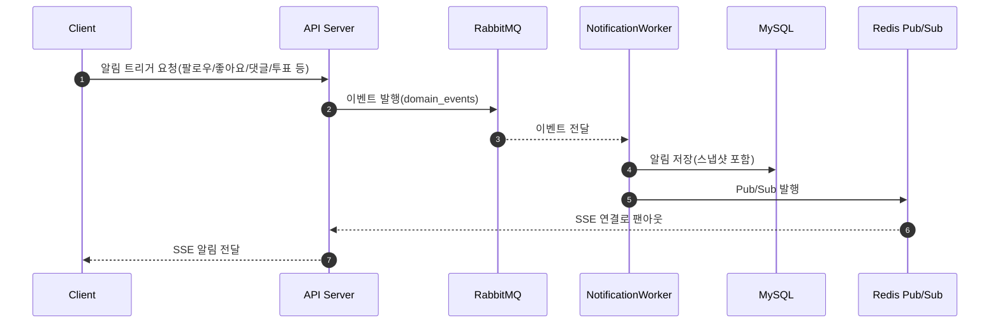

# 배경 (Background)

- 프로젝트 목표: 알림/채팅/집계 처리를 비동기화해 응답 지연과 장애 전파를 줄인다.
- 문제 정의:
  - 동기 처리만으로는 이벤트 처리 지연과 리소스 경쟁이 발생한다.
  - 실시간 전달(SSE/WS)과 저장은 분리되어야 유실을 방지할 수 있다.

# 목표가 아닌 것 (Non-goals)

- 글로벌 멀티리전 메시징
- 스트림 분석/리플레이 기반 BI
- 알림 등급(중요/일반) 분리 정책

# 설계 및 기술 자료 (Architecture and Technical Documentation)

## 사용 기술

- 메시지 브로커: RabbitMQ
- 실시간 전송: Redis Pub/Sub + SSE
- 채팅 실시간: WebSocket
- 저장소: MySQL

## 비동기 이벤트 흐름 정의

- 팔로우 생성: `FollowCreated` → NotificationWorker
- 팔로우 해제: `FollowDeleted` → AggregateWorker
- 게시글 좋아요: `PostLiked` → NotificationWorker
- 댓글 생성: `CommentCreated` → NotificationWorker
- 투표 종료: `VoteClosed` → NotificationWorker
- 채팅 메시지 전송: `ChatMessageSent` → ChatPersistWorker, RealtimeFanoutWorker

## 메시지 브로커/큐 선정

- RabbitMQ 선택
  - 내구성 보장, 재시도/DLQ 지원, 운영 도구 성숙.
  - 알림 저장/재처리 요구를 만족.
- Redis 역할
  - 실시간 전달 전용(Pub/Sub).
  - 저장/재처리는 RabbitMQ + DB로 수행.
- 알림 저장 정책
  - 알림 저장은 MQ 소비자가 비동기로 처리한다.
  - 실시간 전송은 best-effort로 처리하며, 실패 시 알림함 조회로 보완한다.
- RabbitMQ vs Redis Streams 비교(알림 비동기 기준)

## 이벤트 스키마(메시지 포맷)

- 공통 필드:
  - eventId (UUID)
  - eventType
  - occurredAt (ISO8601)
  - actorId
  - targetId
  - refId (post/comment/vote 등)
  - payload (타입별 상세)

## 큐/토픽 구성

- exchange: `domain_events`
- queue:
  - `notification_queue`
  - `aggregate_queue`
  - `chat_persist_queue`
  - `chat_fanout_queue`
- DLQ:
  - `notification_dlq`
  - `aggregate_dlq`
  - `chat_persist_dlq`
  - `chat_fanout_dlq`

## 공통 재처리/재시도 정책(베이스라인)

- 공통 원칙
  - at-least-once 소비를 기본으로 한다.
  - eventId(UUID)를 멱등 키로 사용한다.
  - 실패 시 재시도 후 DLQ로 격리한다.
- 재시도 규칙(초안)
  - 재시도 횟수: 3회
  - 백오프: 200ms -> 1s -> 3s
  - confirm/처리 타임아웃: 2초
- TODO(도메인별 조정 필요)
  - 알림/채팅/집계별 재시도 횟수와 백오프 조정
  - DLQ 재처리 주체 및 방식 정의(자동/수동/배치)

## 알림 도메인 재처리 정책

- 저장 실패
  - DB 저장 실패는 재시도 후 DLQ로 격리한다.
  - DLQ는 수동/배치 재처리로 운영한다.
- 실시간 전송 실패
  - SSE 전송 실패는 재시도하지 않고 버린다.
  - 알림함 조회로 보완한다.

## 비동기 작업(Worker) 로직

### NotificationWorker
1) RabbitMQ 이벤트 수신
2) 알림 엔티티 DB 저장
3) Redis Pub/Sub으로 실시간 전송(SSE)

### AggregateWorker
- 팔로우/투표/좋아요 집계 업데이트(멱등 처리)

### ChatPersistWorker
- 채팅 메시지 DB 저장(실패 시 재시도)

### RealtimeFanoutWorker
- Redis Pub/Sub로 실시간 팬아웃

## 실시간 알림 흐름(요약)



## 집계 카운트 처리 정책 (댓글/게시글/좋아요)

- 집계는 Redis를 기준으로 처리하며, DB는 최종 동기화 대상으로 둔다.
- 실시간 토글/생성 시 Redis에서 카운트를 증감하고, 비동기로 DB에 반영한다.
- Redis는 집계의 실시간 소스로 사용하고, DB는 배치/이벤트 기반으로 수렴시킨다.
- 클라이언트에는 항상 절대값 카운트를 응답하며, 클라이언트는 값을 덮어쓰기만 한다.
- 서버가 DB/Redis 값을 합산해 최종 카운트를 계산하고, 클라이언트 합산 로직은 사용하지 않는다.
- Redis 값이 없거나 조회 실패 시 DB 값을 fallback으로 사용한다.

## SSE 스트림 API 스펙

### 엔드포인트
- `GET /api/notifications/stream`

### 인증
- `Authorization: Bearer {AT}` 헤더 기반

### 응답 헤더
SSE/HTTP 표준에 따른 권장 설정  

- `Content-Type: text/event-stream`
- `Cache-Control: no-cache`
- `Connection: keep-alive`

### 이벤트 포맷
```
id: {eventId}
event: notification
data: {"id":1,"type":"POST_LIKE","message":"...","refId":100}

```

### 재연결/재전송 정책
- 클라이언트는 자동 재연결(EventSource 기본 동작).
- 서버는 재접속 시 최근 10건의 미수신 알림을 재전송한다: 재접속 직후 UX를 보장하면서도 과도한 재전송 부하를 방지하기 위함.
- 미수신 기준은 `read_at is null`이며, 최근 20건을 `created_at desc`로 조회한다.

### 동시 접속 제한
- 사용자당 SSE 연결은 1개만 허용한다.
- 신규 연결이 들어오면 기존 연결을 종료한다.

### 운영/스케일링 고려
- SSE 연결은 장시간 유지되므로, 서버 스레드 점유가 최소화되도록 비동기(서블릿 async) 처리로 운용한다.
- 수평 확장 시 Sticky Session 또는 Redis Pub/Sub으로 인스턴스 간 팬아웃을 고려한다.
  - SSE 연결은 인스턴스 로컬에 매달리므로 라우팅 정책이 중요하다.

## 알림 저장/보관 정책

- 알림은 DB에 저장한다.
- 읽음 처리 후 7일이 지나면 삭제한다.
- 미읽음 알림은 보관 기간 제한 없이 유지한다.

## SSE vs WebSocket 선택 근거

- 알림은 단방향이므로 SSE가 적합.
- 채팅은 양방향이므로 WebSocket을 사용한다.

## 이외 고려사항들 (Other Considerations)

- SSE 연결은 인스턴스별로 유지되므로, 수평 확장 시 Sticky Session 또는 Redis Pub/Sub을 고려한다.
- 알림 조회 API는 커서 기반 인피니티 스크롤로 동작한다.

## 관련 도메인 문서

- `docs/domain-tech-spec/NOTIFICATION_TECH_SPEC.md`
- `docs/domain-tech-spec/CHAT_TECH_SPEC.md`

# 용어 정의 (Glossary)

- SSE: Server-Sent Events, 서버 → 클라이언트 단방향 스트림
- DLQ: Dead Letter Queue, 재시도 실패 메시지 보관 큐
